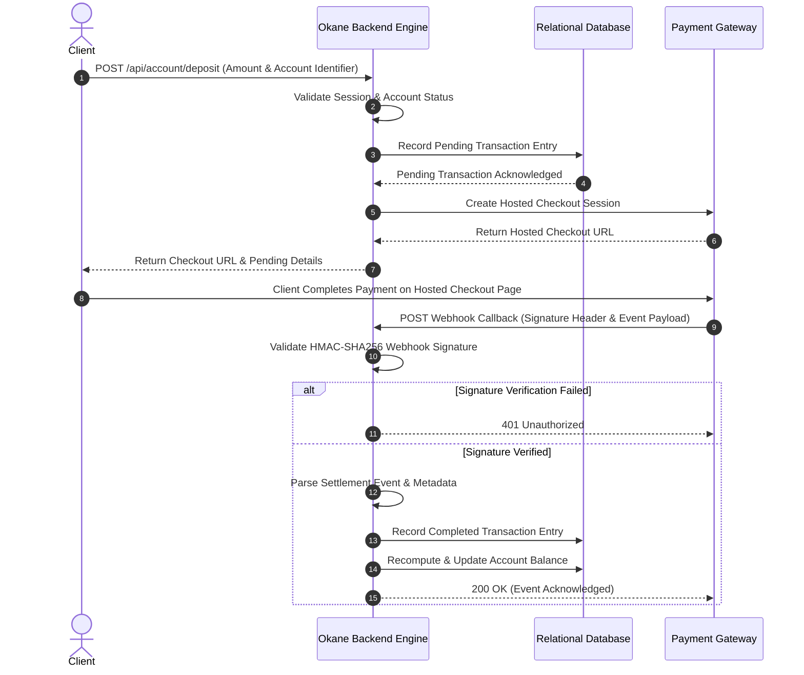

# 💴 Okane (お金) — High-Performance Financial Ledger & Payment Processing Engine

[](https://www.rust-lang.org/)
[](https://github.com/tokio-rs/axum)
[](https://www.postgresql.org/)
[](https://github.com/launchbadge/sqlx)
[](https://tokio.rs/)
[](#security-architecture)

**Okane** is an enterprise-grade, asynchronous financial backend engine and transaction ledger built with **Rust**, **Axum**, and **PostgreSQL**. Engineered for high throughput, memory safety, and fixed-precision financial arithmetic, Okane powers secure account operations, internal peer-to-peer transfers, and asynchronous e-wallet/card deposits via payment gateway integration.

---

## 📌 Executive Summary

Modern financial backends require absolute data integrity, strict cryptographic validation, and resilient session management. Okane is designed to address core financial systems challenges:

- **Fixed-Precision Financial Math**: Implements fixed-point decimal arithmetic to eliminate IEEE 754 floating-point rounding errors during transaction processing.
- **Double-Entry Dynamic Balance Auditing**: Computes account balances dynamically from an immutable transaction history, ensuring auditable and tamper-evident state tracking.
- **Payment Gateway Integration**: Integrates with third-party checkout API services (supporting e-wallets and card payments) with asynchronous, webhook-driven settlement.
- **Cryptographic Webhook Validation**: Enforces HMAC-SHA256 signature verification with constant-time comparison to protect payment settlement endpoints against spoofing.
- **Stateless & Secure Session Security**: Employs Argon2id password hashing and HTTP-Only, SameSite cookie-based session management for secure client interaction.

---

## 🏗️ System Architecture

Okane follows a clean, modular, multi-layered architecture adhering to the **Separation of Concerns (SoC)** principle.

```
                    ┌────────────────────────────────────────┐
                    │          Client Application            │
                    └───────────────────┬────────────────────┘
                                        │ (HTTPS / Secure Cookies)
                                        ▼
 ┌────────────────────────────────────────────────────────────────────────────────────┐
 │  API Routing & Dispatcher Layer                                                    │
 │  ├── Authentication & Identity Routes                                              │
 │  ├── User Profile Routes                                                           │
 │  ├── Financial Account & Webhook Routes                                            │
 │  └── Transaction Ledger Routes                                                     │
 └──────────────────────────────────────┬─────────────────────────────────────────────┘
                                        │
                                        ▼
 ┌────────────────────────────────────────────────────────────────────────────────────┐
 │  HTTP Handlers & Middleware Layer                                                  │
 │  ├── Request Extraction & Input Validation                                         │
 │  └── Security Context, CORS & Tracing Middleware                                  │
 └──────────────────────────────────────┬─────────────────────────────────────────────┘
                                        │
                                        ▼
 ┌────────────────────────────────────────────────────────────────────────────────────┐
 │  Domain Services Layer                                                             │
 │  ├── Identity & Credential Service                                                 │
 │  ├── Ledger & Balance Calculation Service                                          │
 │  ├── External Payment Gateway Service                                              │
 │  └── Audit Log & Transaction Service                                               │
 └───────────────────┬────────────────────────────────────────┬───────────────────────┘
                     │                                        │
                     ▼                                        ▼
 ┌──────────────────────────────────────┐  ┌──────────────────────────────────────────┐
 │  Relational Database (Connection Pool│  │  External Payment Gateway API            │
 │  ├── User Identity Store             │  │  ├── Hosted Checkout Sessions            │
 │  ├── Financial Accounts Store        │  │  └── Asynchronous Payment Webhooks       │
 │  └── Immutable Transaction Ledger    │  └──────────────────────────────────────────┘
 └──────────────────────────────────────┘
```

### Logical Component Architecture

| Architectural Layer | Core Responsibility |
| :--- | :--- |
| **Server & Connection Management** | Manages application lifecycle, environment loading, database connection pooling, and Tokio TCP listeners. |
| **Routing & Middleware** | Assemblies API routes, configures CORS policies, handles request tracing, and enforces security middleware. |
| **HTTP Handlers** | Extracts incoming payloads, validates inputs, handles cookie extraction, and maps domain responses to standard HTTP status codes. |
| **Domain Services** | Implements core business rules, ledger calculations, cryptographic hashing/verification, and external gateway integration. |
| **Data Access & Storage** | Executes type-safe relational database operations against persistent storage. |
| **Error Handling** | Translates internal domain and database errors into standardized, secure HTTP JSON error responses. |

---

## 🔄 Data Flow & Payment Lifecycle

### Asynchronous Deposit & Webhook Settlement Flow

The deposit lifecycle decouples payment initiation from settlement using signed webhook callbacks to maintain ledger consistency.



---

## 🗄️ High-Level Data Model & Storage

The system utilizes a relational database structure designed for ACID-compliant ledger operations.

```mermaid
erdiagram
    USER_IDENTITY ||--o{ FINANCIAL_ACCOUNT : "owns"
    FINANCIAL_ACCOUNT ||--o{ TRANSACTION_LEDGER : "source"
    FINANCIAL_ACCOUNT ||--o{ TRANSACTION_LEDGER : "destination"

    USER_IDENTITY {
        Identifier id
        String email
        String credentials
        String role
        Timestamp created_at
    }

    FINANCIAL_ACCOUNT {
        Identifier id
        Identifier user_id
        String account_identifier
        String account_type
        Numeric balance
        String status
        Timestamp created_at
    }

    TRANSACTION_LEDGER {
        Identifier id
        UUID correlation_id
        String source_account
        String destination_account
        Numeric amount
        String transaction_type
        String status
        Timestamp created_at
    }
```

### Data Integrity Principles

1. **Immutable Transaction History**: Transactions are written as append-only records. Financial balances are derived from completed transaction histories.
2. **Numeric Precision**: Monetary values are stored using fixed-precision numeric types (`NUMERIC(30, 2)`) to eliminate floating-point drift.
3. **Correlation Tracking**: Transaction lifecycle events share an immutable correlation identifier to link initial requests with asynchronous settlement events.

---

## 🔒 Security Architecture

Okane incorporates defense-in-depth security principles to protect identity, ledger data, and external integration points:

### 1. Argon2id Credential Hashing
User passwords are never stored in plain text. Credentials are hashed using the memory-hard **Argon2id** algorithm with unique, cryptographically random salt strings per user, defending against GPU-based cracking and rainbow table attacks.

### 2. Cryptographic Webhook Authentication (HMAC-SHA256)
Incoming webhook events from payment providers are cryptographically authenticated before processing:
- **Timestamped Payload Reconstruction**: Combines the request timestamp with the raw HTTP request body.
- **HMAC Calculation**: Computes the expected digest using a shared secret and SHA-256 algorithm.
- **Constant-Time Comparison**: Compares signatures using constant-time evaluation to prevent timing attacks.

### 3. Session Security & Cookie Protection
Authentication sessions utilize signed JSON Web Tokens (JWT) delivered via **HTTP-Only, SameSite** cookies:
- **XSS Mitigation**: Client-side JavaScript cannot access session tokens stored in HTTP-Only cookies.
- **CSRF Mitigation**: Enforces strict origin validation and SameSite cookie attributes.
- **Least-Privilege Token Claims**: Claims contain minimal scope required for route authorization and token expiration enforcement.

---

## 📡 API Interface Overview

Base URL: `/api`

### Endpoint Catalog

| Group | Method | Endpoint | Description | Auth Required |
| :--- | :--- | :--- | :--- | :---: |
| **Auth** | `POST` | `/api/auth/register` | Registers a user and provisions an active account | No |
| **Auth** | `POST` | `/api/auth/login` | Authenticates credentials and issues session cookie | No |
| **User** | `GET` | `/api/user/me` | Fetches authenticated user profile | Yes |
| **Account** | `GET` | `/api/account/my-account` | Fetches current account state & ledger balance | Yes |
| **Account** | `POST` | `/api/account/deposit` | Initiates payment gateway checkout session | Yes |
| **Account** | `POST` | `/api/account/transfer` | Executes peer-to-peer account transfer | Yes |
| **Account** | `POST` | `/api/account/withdraw` | Records an account withdrawal entry | Yes |
| **Account** | `POST` | `/api/account/webhook/paymongo` | Handles incoming payment gateway webhooks | Signature |
| **Ledger** | `GET` | `/api/transaction/my-transactions` | Retrieves historical transaction audit log | Yes |

### Sample Request & Response Schemas

#### Deposit Request (`POST /api/account/deposit`)
```json
{
  "account_number": "ACC-10029384",
  "amount": 500.00
}
```

#### Deposit Response (`200 OK`)
```json
{
  "message": "Deposit initiated successfully",
  "checkout_url": "https://checkout.gateway.com/session/cs_live_sample",
  "transaction": {
    "transaction_uuid": "f47ac10b-58cc-4372-a567-0e02b2c3d479",
    "amount": "500.00",
    "type": "deposit",
    "status": "pending"
  }
}
```

---

## ⚡ Error Handling & Resiliency

Okane implements a unified error handling architecture that categorizes failures into predictable HTTP responses without leaking internal stack traces or database schema details to clients:

```json
{
  "error": "Human-readable description of the error"
}
```

| HTTP Status | Category | Description |
| :--- | :--- | :--- |
| `400 Bad Request` | Validation Failure | Invalid input payload, non-positive financial amounts, or validation rule violations. |
| `401 Unauthorized` | Security Failure | Missing/expired session cookie, invalid credentials, or failed webhook signature check. |
| `404 Not Found` | Resource Missing | Non-existent user, account, or target entity. |
| `500 Internal Error` | System Failure | Abstraction wrapper for downstream service timeouts or database pool exhaustion. |

---

## 💻 Technical Stack & Dependencies

- **Language & Runtime**: Rust (2024 Edition) on `tokio` multi-threaded asynchronous runtime.
- **Web Layer**: `axum` with `tower-http` middleware for CORS and request logging.
- **Persistence & ORM**: `sqlx` providing compile-time type-checked SQL queries against PostgreSQL.
- **Security & Crypto**: `argon2`, `jsonwebtoken`, `hmac`, `sha2`, `hex`, and `rand`.
- **Financial Precision**: `rust_decimal` for accurate fixed-point monetary computations.
- **HTTP Client**: `reqwest` for external payment gateway API communications.

---

## 🚀 Environment Configuration & Local Setup

### Environment Variables Template

Create a `.env` configuration file in the project root:

```env
DATABASE_URL=postgres://<username>:<password>@<host>:<port>/<database_name>
JWT_SECRET=<secure_random_jwt_signing_key>
PAYMONGO_SECRET_KEY=<payment_gateway_api_key>
PAYMONGO_WEBHOOK_SECRET=<payment_gateway_webhook_signing_secret>
FRONTEND_ORIGIN=http://localhost:8081
ADDR=127.0.0.1:3000
COOKIE_SECURE=false
```

### Installation Steps

1. **Clone the Repository**:
   ```bash
   git clone https://github.com/SioPauwiii/okane.git
   cd okane/server
   ```

2. **Database Provisioning**:
   Ensure PostgreSQL is running, then execute database creation and migrations:
   ```bash
   sqlx database create
   sqlx migrate run
   ```

3. **Build and Run**:
   ```bash
   cargo run
   ```

4. **Verify Health Endpoint**:
   ```bash
   curl http://127.0.0.1:3000/health
   # Response: OK
   ```

---

## 👨‍💻 Key Architectural Principles

1. **Memory Safety & High Concurrency**: Rust's borrow checker guarantees data-race freedom and memory safety across concurrent async tasks without garbage collection pauses.
2. **Immutable Double-Entry Ledger**: Account balances are dynamically audited from complete transaction logs rather than mutative overwrites, ensuring data integrity.
3. **Fixed-Point Financial Arithmetic**: Uses explicit decimal precision to avoid floating-point loss in financial transactions.
4. **Idempotent Webhook Settlement**: Links pending and completed entries via unique correlation tokens to prevent duplicate balance adjustments.

---

## 📜 License

This project is licensed under the [MIT License](LICENSE).
